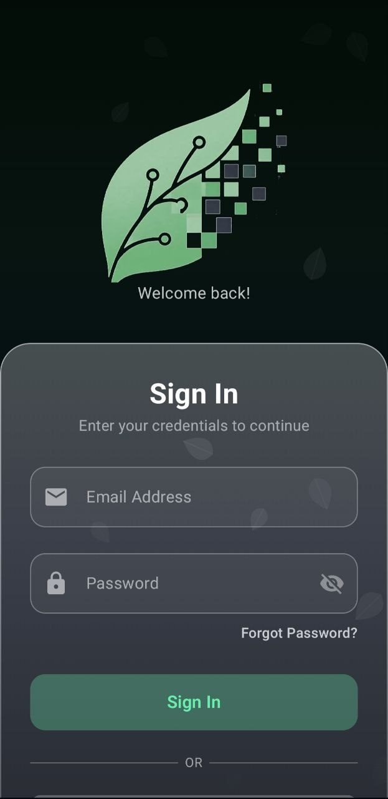
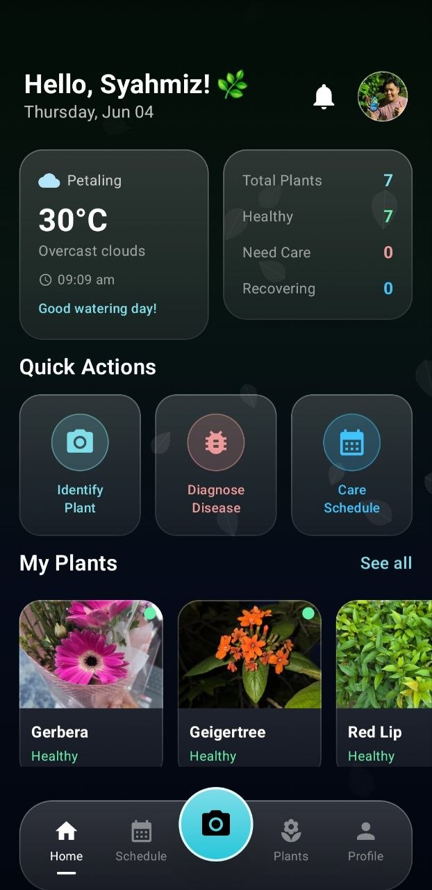
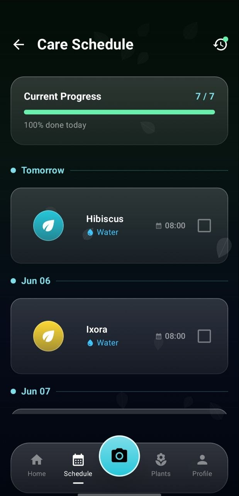
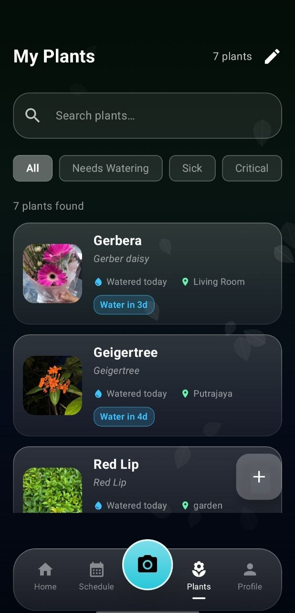
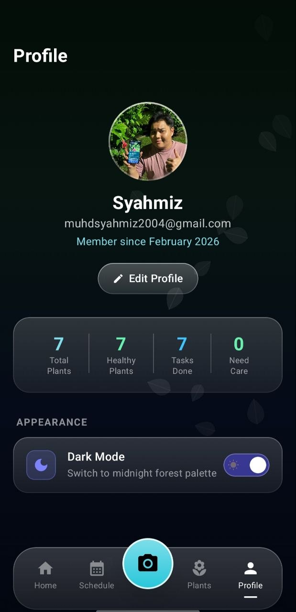
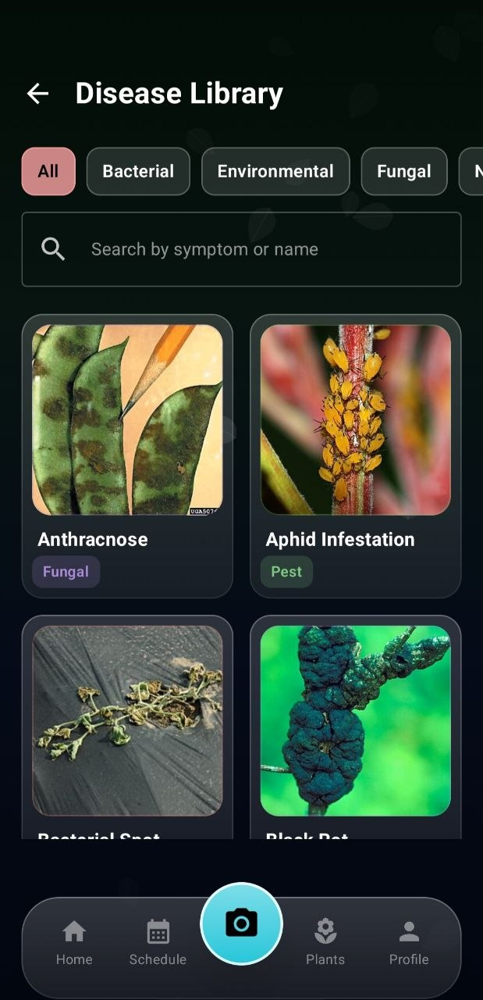
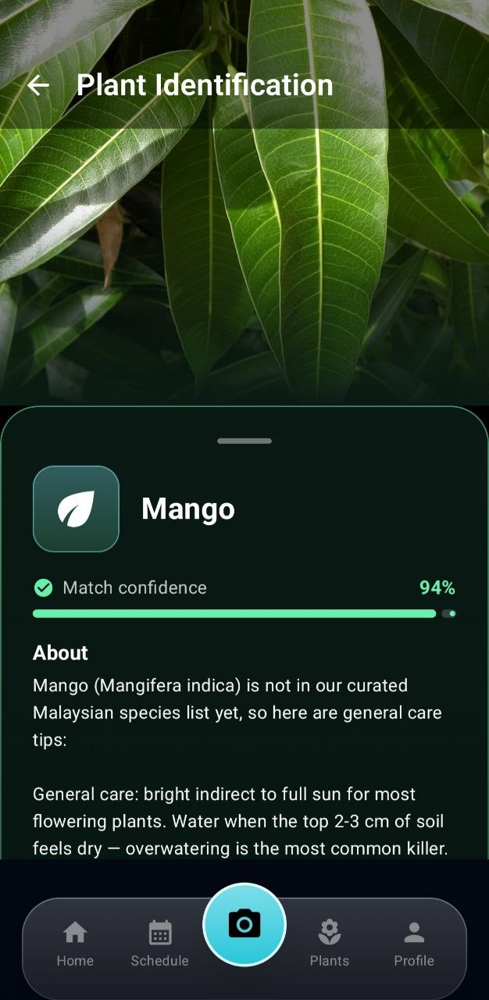

# MyFlora - Malaysian Plant Care App

MyFlora is an Android plant care app built with Jetpack Compose, Room, CameraX, and Retrofit. It combines flower identification, basic disease diagnosis, weather-aware care guidance, a personal plant collection, and per-user care scheduling.

## Interface Preview

| Sign In | Dashboard | Care Schedule |
|:---:|:---:|:---:|
|  |  |  |
| **My Plants** | **Profile** | **Disease Library** |
|  |  |  |
| **Plant Identification** | | |
|  | | |

## What Changed

This update adds a real offline flower-identification pipeline to MyFlora and keeps PlantNet as the secondary option.

- MyFlora now uses an on-device TensorFlow Lite flower classifier first.
- PlantNet is now a fallback instead of the primary identifier.
- The offline model was trained from the Roboflow `Malaysian Flower Detection` dataset, version 2.
- The app now ships with a local model asset and label file in `app/src/main/assets/models/`.
- The offline model currently supports 4 flowers: `Bougainvillea`, `Crape Jasmine`, `Hibiscus`, and `Ixora`.
- PlantNet is still used when the offline model is not confident enough.
- New species reference data was added for `Crape Jasmine` and `Ixora`.
- The plant-care database was moved to version 5 so existing installs can receive the new species entries.
- The destructive Room fallback was removed from `PlantCareDatabase`.
- Reproducible ML scripts were added for download, dataset preparation, and retraining.

## How Flower Identification Works Now

1. The camera captures a flower photo.
2. MyFlora runs the local TensorFlow Lite classifier first.
3. If the top offline confidence is at least `0.78`, MyFlora returns the offline result immediately.
4. If the offline confidence is lower and `PLANTNET_API_KEY` is configured, MyFlora calls PlantNet and merges the results.
5. If PlantNet fails, MyFlora falls back to the offline result when the local confidence is at least `0.45`.

This makes MyFlora independent for its supported flower set while still keeping PlantNet available for broader coverage.

## Current Offline Coverage

The shipped on-device model is trained for:

- Bougainvillea
- Crape Jasmine
- Hibiscus
- Ixora

Anything outside those four is more likely to rely on PlantNet.

## Dataset and Training Pipeline

Dataset source:

- Roboflow Universe project: `my-workspace-rnskj/malaysian-flower-detection`
- Version used: `2`
- Export format used for training: `yolov8`
- Dataset license shown by Roboflow export: `BY-NC-SA 4.0`

Training flow:

1. Download the Roboflow detection dataset.
2. Convert bounding boxes into cropped classification images.
3. Train a MobileNetV2-based classifier with TensorFlow.
4. Export the best model as `.tflite`.
5. Copy the model and labels into the Android app assets.

Scripts added:

- `ml/scripts/download_roboflow_dataset.py`
- `ml/scripts/build_classification_dataset.py`
- `ml/scripts/train_flower_classifier.py`

Generated local folders:

- `ml/downloads/`
- `ml/generated/`
- `ml/models/`

These folders are ignored by Git. The shipped app assets are copied into:

- `app/src/main/assets/models/flora_flower_classifier.tflite`
- `app/src/main/assets/models/flora_flower_labels.json`

## Training Commands

Install the local Python dependencies:

```powershell
python -m pip install --target .\.pydeps roboflow tensorflow pillow numpy scikit-learn
```

Set the local Python path for the training scripts:

```powershell
$env:PYTHONPATH=(Resolve-Path .\.pydeps).Path
$env:PYTHONNOUSERSITE='1'
```

Download the Roboflow dataset:

```powershell
python .\ml\scripts\download_roboflow_dataset.py
```

Build the cropped classification dataset:

```powershell
python .\ml\scripts\build_classification_dataset.py
```

Train and export the TensorFlow Lite model:

```powershell
python .\ml\scripts\train_flower_classifier.py
```

## Model Notes

The current shipped model was trained from the cropped Roboflow dataset generated from version 2 of the project.

Current saved metrics:

- image size: `224`
- labels: `Bougainvillea`, `Crape Jasmine`, `Hibiscus`, `Ixora`
- test accuracy on the generated cropped test split: `1.0`

Important note:

- that accuracy comes from a small controlled test split of 90 cropped samples
- it is useful as a project metric, but it should not be treated as proof of real-world perfection

## API Keys

The app now uses these keys:

- `OPENWEATHER_API_KEY`
- `ROBOFLOW_API_KEY`
- `PLANTNET_API_KEY`

Usage:

- `OPENWEATHER_API_KEY`: runtime weather data
- `ROBOFLOW_API_KEY`: dataset download and retraining workflow
- `PLANTNET_API_KEY`: runtime fallback flower identification

Example `local.properties`:

```properties
OPENWEATHER_API_KEY=your_openweather_key
ROBOFLOW_API_KEY=your_roboflow_key
PLANTNET_API_KEY=your_plantnet_key
```

## Features

### Flower Identification

- Offline-first flower identification with TensorFlow Lite
- PlantNet fallback for broader recognition
- Species details loaded from the local Room database
- Signed-in users can save identified plants into their collection
- Saving an identified plant creates a starter watering task automatically

### Disease Diagnosis

- Local heuristic leaf-disease analysis
- Detects several common disease patterns and gives confidence estimates

### Weather

- Live weather from OpenWeatherMap using device location
- Watering advice based on current conditions

### My Plants

- Personal plant collection per account
- Search and filter support
- Plant detail view with protected health logs

### Care Schedule

- Per-user task list
- Task completion persists in Room
- Starter watering tasks are created for new saved plants

### Auth and Profile

- Register, login, and guest mode
- Guest mode is read-only
- PBKDF2 password hashing with legacy upgrade support
- Profile stats come from user-scoped data

## Data Model Notes

Seeded reference data now includes:

- 7 flower species
- 5 disease entries

New species added in this update:

- Crape Jasmine
- Ixora

User-generated content remains scoped per signed-in account:

- plants
- care schedules
- plant detail access
- plant health logs

## Architecture

```text
MVVM + Room + Retrofit + CameraX + TensorFlow Lite
```

## Testing

Verified locally with:

```powershell
$env:JAVA_HOME='C:\Program Files\Android\Android Studio\jbr'
.\gradlew.bat testDebugUnitTest
```

## Setup

1. Clone the repository.
2. Copy `local.properties.example` to `local.properties` and fill in the keys
   listed in the **API Keys** section above. `local.properties` is gitignored
   and must never be committed.
3. Download or regenerate the on-device flower classifier model. The 235 MB
   `plantnet300k.tflite` asset is *not* included in the repo because it
   exceeds GitHub's 100 MB per-file limit. Regenerate it from a PyTorch
   checkpoint with:

   ```powershell
   $env:PYTHONPATH=(Resolve-Path .\.pydeps).Path
   $env:PYTHONNOUSERSITE='1'
   python .\ml\scripts\convert_alexnet_pth_to_tflite.py --pth path\to\best_model.pth
   ```

   The script writes the file into `app/src/main/assets/models/plantnet300k.tflite`.
   Without it, only the cloud PlantNet API will be used for identification.
4. Open the project in Android Studio and sync Gradle.
5. Run on a device or emulator. Use a physical device for the best camera
   experience.

## Security Notes

- All third-party API keys are read from `local.properties` via
  `BuildConfig.*` — none are committed to source.
- User passwords are hashed with PBKDF2-HMAC-SHA1 (per-user salt) in
  `data/repository/PasswordSecurity.kt`. Plain-text passwords are never
  stored.
- The Room database lives only on the device
  (`/data/data/com.example.flora/databases/`) and is never committed.
- Uninstalling the app wipes all user data.
